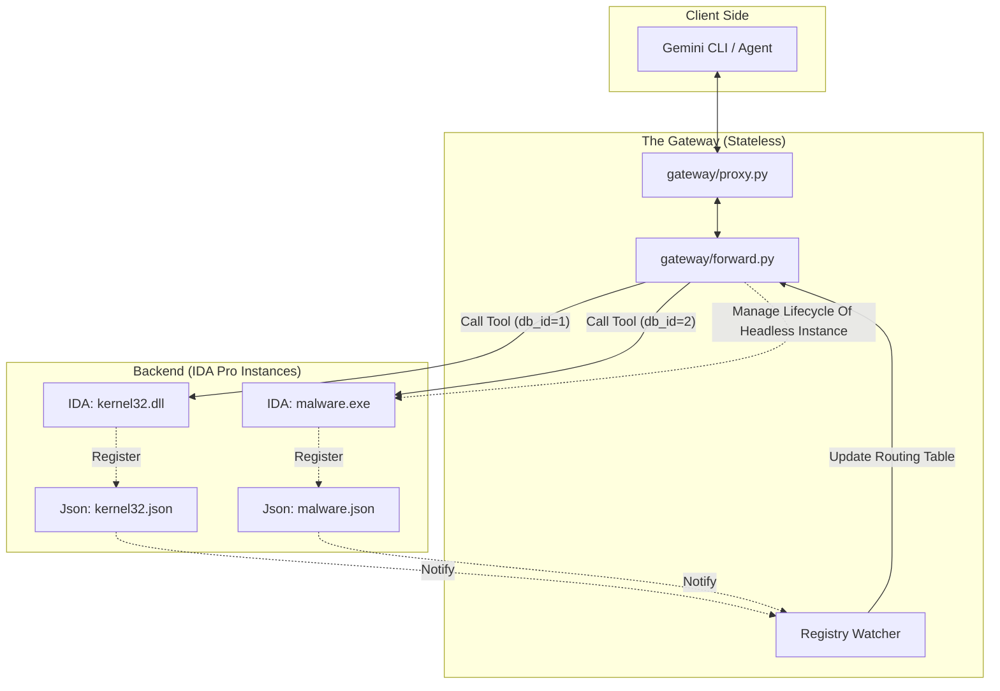
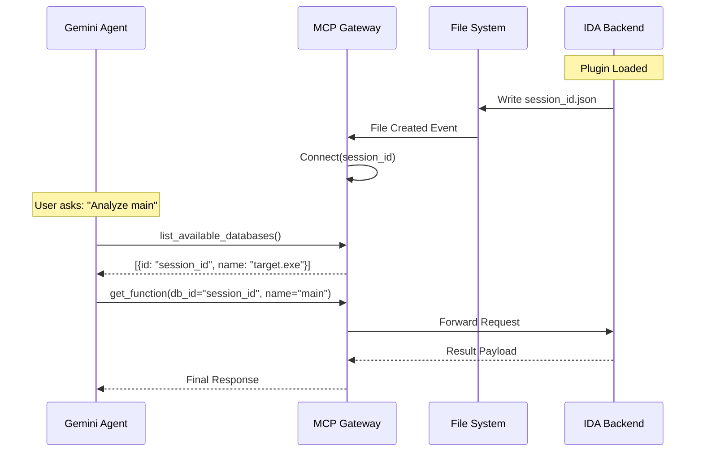
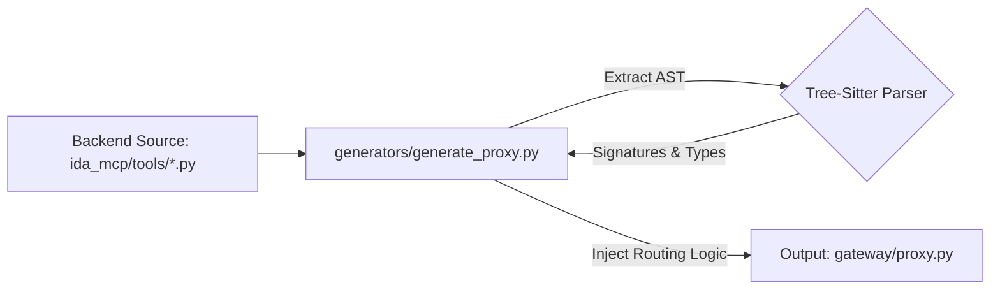

# IDA Pro MCP Server: System Design & Architecture

## 1. Executive Summary

This document outlines the architecture and system design of the IDA Pro MCP
server, developed to support multi-session workflows, relational SQLite
querying, and robust AI agent integration across diverse environments.

### Background & Integration Considerations

In our early exploration of integrating AI agents with IDA Pro, several
practical considerations emerged:

*   **AI Client Differences**: Various agent clients have different levels of
    support for dynamic tools, prompts, and schema representations.
*   **Multi-Session Workflows**: Workflows often involve analyzing multiple
    binaries concurrently or running headless IDA instances in the background.
*   **Performance Overhead**: Listing operations over large binaries can lead to
    high memory usage and latency if all symbols are loaded into memory at once.
*   **Cross-Architecture Requirements**: Real-world binaries span x86, ARM,
    MIPS, RISC-V, and other architectures requiring consistent analysis.
*   **Relational Querying**: Answering complex questions about binary metadata
    often requires multi-dimensional queries across functions, strings, types,
    and cross-references.

### Architectural Components

The system architecture incorporates the following design choices:

1.  **Relational SQL Query Engine**: Embedded SQLite database populated
    dynamically via IDA event hooks, with a query translation layer (`sqlglotc`)
    to resolve 64-bit unsigned arithmetic and hex literals. Read queries execute
    concurrently in background worker threads without acquiring IDA's main
    thread lock.
2.  **Stateless Session Management**: A Gateway architecture allowing agents to
    interact with multiple IDA instances (GUI and Headless) concurrently without
    manual client reconfiguration.
3.  **Multi-Client Support**: Centralized proxy gateway with setup support for
    **Gemini CLI**, **Jetski / Antigravity CLI (Agy)**, and **Claude Code**
    using a unified installer.
4.  **Analysis & Navigation Tools**: Tools for UI navigation, memory patching,
    cross-references, database exporting (`export_file`), and structured data
    creation.
5.  **Paginated Resource Caching**: Paginated resource iterators to reduce
    memory overhead and latency when querying large symbol tables.
6.  **Cross-Architecture Analysis**: Utilizing Hex-Rays Microcode to support
    diverse architectures (ARM, MIPS, RISC-V, x86) with consistent semantic
    understanding.
7.  **WYSIWYG Disassembly Output**: Disassembly tools output formatted text
    matching the IDA Pro UI, including opcodes, labels, and comments, along with
    the `get_ida_view` tool.
8.  **Unix Domain Sockets (UDS) Support**: Secure UDS communication for running
    IDA Pro inside isolated local environments (Linux/macOS).
9.  **Security Dashboard**: Web-based UI for managing permissions for "unsafe"
    tools (e.g., Python execution) and active session tracking.
10. **Robustness & Concurrency**: Non-blocking error handling, thread safety
    synchronization, and structured result formatting across all tools.

--------------------------------------------------------------------------------

## 2. System Architecture: The Gateway Pattern

### Gateway Architecture

This implementation introduces a middle layer—the **Gateway**—which acts as a
dynamic router.

*   **`gateway/proxy.py`**: The stable, user-facing facade. The Client connects
    *only* to this.
*   **`ida_mcp/core/backend_registry.py`**: A lock-free, file-based discovery
    mechanism.
*   **`gateway/forward.py`**: The intelligent router that dispatches requests to
    the correct active IDA instance (local or headless).



This architecture allows **Hot-Swapping**: You can close `malware.exe`, open
`kernel32.dll`, and the Agent doesn't need to disconnect. It simply queries the
Gateway for available databases.

### 2.1 Unix Domain Socket Support

In scenarios where preventing the hosting process from sending telemetry
("phoning home") is required, tools like `unshare -c -n` can be used to launch
software in an isolated network namespace. Since the network interface is
disabled within this namespace, Unix Domain Sockets (UDS) serve as the optimal
communication channel between the gateway and the backend MCP servers. This
feature is supported on Linux and macOS. Windows environments will default to
TCP.

### 2.2 The Universal MCP Gateway Pattern

While implemented here for IDA Pro, this Gateway Architecture provides a
practical pattern for bridging AI Agents with multiple MCP server instances:

1.  **Registry**: Decouples discovery from connection.
2.  **Watcher**: Handles lifecycle events (crashes, restarts) automatically.
3.  **Router**: Maps a request to a specific backend context (`database_id`).

This pattern can also be adapted to other MCP servers wrapping interactive
desktop tools.

--------------------------------------------------------------------------------

## 3. Relational SQL Query Engine (SQLite)

To enable complex, relational queries over binary analysis data (e.g., finding
all functions of a certain size with specific name prefixes, or querying
cross-references matching specific criteria), the server implements a read-only
SQL query engine.

Originally evaluated with DuckDB, the engine was built with **SQLite** for
faster in-memory table population and minimal overhead.

### 3.1 Relational Schema & Tables

The SQLite database maintains the following relational tables representing the
IDA Pro database state:

*   **`functions`**: `name`, `demangled_name`, `start_ea`, `end_ea`, `size`,
    `prototype`, `is_lib`
*   **`strings`**: `address`, `length`, `string`
*   **`names`**: `address`, `name`
*   **`imports`**: `address`, `name`, `module`
*   **`segments`**: `name`, `class`, `start_ea`, `end_ea`, `size`, `permissions`
*   **`local_types`**: `ordinal`, `name`, `declaration`
*   **`xrefs`**: `from_ea`, `to_ea`, `type`, `from_function_ea`
*   **`entries`**: `index_id`, `ordinal`, `address`, `name`
*   **`_db_metadata`**: `key`, `value` (internal table recording session
    metadata such as `image_min_ea`)

### 3.2 SQL Translation Layer (`sqlglotc`)

AI agents frequently write queries using hexadecimal literals (e.g., `0x401000`)
and large 64-bit unsigned memory addresses. Because SQLite natively uses signed
64-bit integers, the query engine utilizes `sqlglot` to parse and adjust SQL
queries before execution:

1.  **Literal Normalization**: Hex literals (`0x401000`) and unsigned 64-bit
    constants are parsed into integers and mapped into SQLite's signed 64-bit
    two's complement integer range (`_to_signed_64`).
2.  **Constant Folding**: `sqlglot.optimizer.simplify` optimizes expressions
    before SQLite execution.
3.  **Native Unsigned 64-bit Comparison Rewriting**: To support correct ordering
    on full 64-bit linear addresses across the signed/unsigned boundary
    (`0x8000000000000000` to `0xffffffffffffffff`), comparison operators (`<`,
    `<=`, `>`, `>=`, `BETWEEN`, `NOT BETWEEN`) are rewritten natively into
    sign-partitioned SQLite boolean expressions. This avoids the latency and GIL
    overhead of custom Python UDF callbacks.
4.  **Hexadecimal Result Formatting**: All integer columns in query result sets
    are automatically formatted into canonical lowercase hexadecimal strings
    (`0x...`).

### 3.3 Live Synchronization & Rebase Lifecycle

Tables are lazily populated on first query or eagerly populated on startup when
`populate_tables_on_startup` is enabled. The server registers IDA `IDB_Hooks`
and `IDP_Hooks` to keep relational tables synchronized in real-time:

*   **Live IDB Events**: Real-time hooks capture renaming of symbols and
    functions, addition/deletion/updating of functions and segments, and
    code/data cross-references (`cref_added`, `dref_added`, `cref_deleted`,
    `dref_deleted`). Renaming events also propagate in real-time to the
    `entries` table, constrained by both address and old symbol name to avoid
    clobbering distinct export aliases sharing the same address.
*   **Entry Points & Freshness Tracking (`check_entries_freshness`)**: IDA does
    not expose dedicated event hooks for entry point additions or removals. In
    addition, for formats like ELF where export ordinals are synthetic and
    invariant, address resolution falls back to the namelist (`get_name_ea`) to
    prevent desynchronization when a database is rebased. Because entry points
    represent the binary's static exported symbols (including functions, global
    variables, and vtables/RTTI) established during loader analysis, they are
    not expected to change once initial auto-analysis completes (symbol renames
    are already tracked via live IDB rename hooks). Consequently,
    `check_entries_freshness` defaults to `False` to avoid redundant checks.
    When enabled, the query engine computes an in-memory fingerprint (`(qty,
    ((ord, ea), ...))`) prior to executing queries against the `entries` table,
    automatically refreshing the table if entry points have been dynamically
    added or removed.
*   **Rebase Detection & Invalidation**: Program rebase notifications
    (`segm_moved` / `allsegs_moved`) invalidate the database by draining pending
    updates and dropping all data tables.
*   **Rebase Completion**: An `ev_auto_queue_empty` IDP hook detects when IDA's
    rebase auto-analysis completes (`ida_auto.auto_is_ok()`), updates the stored
    `image_min_ea` in `_db_metadata`, and triggers table repopulation.
*   **Schema Versioning & Migration**: The database tracks `PRAGMA
    user_version = 3` and records `image_min_ea` in `_db_metadata`. On startup,
    `_check_and_migrate_db` automatically drops and re-initializes tables if a
    schema version mismatch or image base shift across sessions is detected.

### 3.4 Main-Thread Independence & Concurrency

Standard IDA SDK and IDAPython APIs are single-threaded and must execute on
IDA's main thread (via `idaapi.execute_sync`). When an agent runs multiple
queries or when several agents connect simultaneously, relying exclusively on
standard APIs serializes requests and can impact UI responsiveness.

In contrast, the SQLite database operates as an independent relational store.
Once populated, read-only SQL queries run concurrently in worker threads without
acquiring IDA's main thread lock. IDA's main thread is only briefly engaged
during initial data extraction or when handling incremental IDB update hooks,
allowing agents to perform broad metadata searches without interrupting
interactive use.

--------------------------------------------------------------------------------

## 4. Connection Lifecycle & Discovery

The system uses a "Dead Drop" discovery mechanism.

### Workflow

1.  **Registration**: When the IDA Plugin loads, it writes a JSON metadata file
    (PID, Port, Auth Token) to the registry directory (default:
    `~/.ida_mcp_registry`).
2.  **Discovery**: The Gateway runs a `watchdog` thread monitoring this
    directory.
3.  **Connection**: Upon seeing a new JSON file, the Gateway verifies the
    process is alive and adds it to the routing table.
4.  **Routing**: Incoming tool calls include a `database_id`. The Router
    inspects this ID and forwards the payload to the corresponding backend via
    SSE (Server-Sent Events).



Some other proxy implementations require the MCP client first select a session,
then the following tool calls will be based on the selected session. These
implementations keep track of the currently selected session, which impose some
limitations: 1. Can't work with multiple MCP clients simultaneously. 2. The MCP
client and the gateway may be out of sync in scenarios like loading old chats.
MCP client may need to constantly invoke the MCP tools to check which session is
active.

In our implementation, all tools exposed to MCP clients require a session ID as
a parameter. Although this approach consumes slightly more tokens, it is simpler
and more robust, allowing multiple agents to work with multiple backend MCP
server instances simultaneously.

### 3.1 Database Identification Strategy

The `database_id` is a critical component of the routing logic. It acts as the
unique session identifier for a specific analysis context.

**Generation Logic**:

```python
database_id = SHA256(absolute_path_to_idb_file).hexdigest()[:8]
```

**Why not use the Binary Hash?**

A common pitfall is to identify sessions by the hash (MD5/SHA256) of the target
binary. This has limitations in reverse engineering workflows because:

1.  **Version Control**: A user may have multiple snapshots of the analysis
    (e.g., `analysis_v1.i64`, `analysis_final.i64`) for the same binary.

2.  **Concurrency**: A user may want to open the same binary in two different
    IDA instances to compare different decompilation options.

By hashing the **absolute path of the database file** (`.i64` / `.idb`), we
ensure that every specific instance on the disk has a unique, stable identifier.
This allows the Agent to distinguish between different analysis files even if
they target the same executable.

### 4.2 Headless Instance Lifecycle & Quota Policy

When the MCP client opens a binary via `idalib_headless_open`, the Gateway's
`HeadlessManager` spawns and tracks the background process in
`spawned_instances`. To prevent system resource exhaustion, `HeadlessManager`
enforces a strict quota based on `max_headless_instances`:

1.  **Quota Enforcement**: Before spawning a new headless instance, the manager
    checks whether active and pending instances reach `max_instances`
    (`len(self.spawned_instances) + self._pending_spawns >= self.max_instances`).
2.  **Explicit Actionable Error**: If the limit is reached,
    `idalib_headless_open` raises a `ToolError` prompting the caller to close an
    unused instance using `idalib_headless_close(database_id)` before opening a
    new one.
3.  **Clean Teardown**: When `idalib_headless_close` is invoked, the gateway
    immediately frees the capacity slot, gracefully requests the database to
    save and close (`close_database`), closes the RPC connection, and
    terminates the process asynchronously.

--------------------------------------------------------------------------------

## 5. Automated Code Generation (The Build System)

Maintaining a proxy layer manually can be error-prone. If you add a parameter to
`get_function` in the backend but forget to update the proxy, the system breaks.
This is addressed via code generation from backend function signatures.

**Component**: `generators/generate_proxy.py`

This script parses backend source files using `tree-sitter` to perform static
analysis on the backend implementation.

### The Pipeline

1.  **Scan**: Recursively walks the `ida_mcp/tools/` directory to find all
    Python files.
2.  **Parse**: Extract every function decorated with `@jsonrpc` using
    Tree-Sitter.
3.  **Analyze**: Capture the function signature, type hints, docstrings, and
    decorators.
4.  **Transpile**: Generate a corresponding `async` function for the Proxy.
    *   Injects the `database_id` parameter automatically.
    *   Wraps the call in `forward_to()`.
5.  **Emit**: Writes the corresponding `gateway/proxy.py`.



--------------------------------------------------------------------------------

## 6. Analysis Engine: Microcode-Driven Architecture

To support reverse engineering across CPU architectures, the analysis engine
leverages **Hex-Rays Microcode** rather than standard assembly parsing.

### 6.1 Rationale for Hex-Rays Microcode

Traditional assembly-centric approaches (relying on `ida_ua.decode_insn`) have
limitations:

*   **Architecture Dependence**: Assembly varies widely across architectures
    (x86, ARM, MIPS, PowerPC), requiring complex CPU-specific parsers.
*   **Loss of Context**: Indirect calls (e.g., `call rax` or register-relative
    jumps) are difficult to resolve by looking at raw instructions.

By leveraging the Hex-Rays Microcode API, the analysis engine operates on the
Decompiler's Intermediate Representation (IR). In this IR, architectural
differences are abstracted away (e.g., both `MOV EAX, [EBX]` on x86 and `LDR R0,
[R1]` on ARM translate into the same semantic load index `m_ldx` operation).

This provides:

1.  **Architecture Independence**: The same analysis logic works across
    architectures supported by Hex-Rays.
2.  **Propagation**: Indirect calls and data offsets are pre-resolved by the
    decompiler's analyzer before the engine queries them, providing improved
    accuracy.

### 6.2 WYSIWYG Disassembly

The disassembly engine is designed to return a formatted "What You See Is What
You Get" (WYSIWYG) text stream rather than parsed structural JSON blocks.

While structured JSON line-by-line representations are programmatically
convenient, they often omit visual context that reverse engineers and LLMs rely
on: cross-reference headers, auto-generated decompilation comments, data
definition blocks, alignment padding, and indentation formatting.

*   **WYSIWYG Streams (`disassemble_function` and `disassemble_code`)**: Return
    formatted, multi-line text precisely as it is rendered in the IDA Pro GUI,
    retaining operand padding, inline comments, and offset labels.
*   **Forced Decoding**: Explicitly decodes arbitrary byte blocks into valid
    instructions even in unanalyzed or obfuscated regions.
*   **Unified Views (`get_ida_view`)**: Introduces a viewport tool to capture
    arbitrary memory regions (including hybrid code/data structures) as
    displayed in IDA.

### 6.3 Observability & Navigation Tools

A suite of tools was added to improve the agent's ability to explore and
manipulate the database:

*   **UI Integration**: `jump_to_address` and `set_color` allow the agent to
    interact with the user's GUI session.
*   **Relationship Mapping**: `get_xrefs_from`, `get_data_xrefs_from`, and
    `get_comment` provide a more complete picture of code and data flow.
*   **Raw Observation**: `hexdump` acts as a complement to `get_ida_view` when
    exploring raw binary structures or encrypted payloads.

--------------------------------------------------------------------------------

## 7. Remote Python Execution Engine (`idapython_eval`)

The server provides a Python execution tool (`idapython_eval`) designed to let
agents interact dynamically with the IDA Pro Python API (IDAPython).

The execution logic was adapted from `ida-pro-mcp` and updated to support
interactive evaluation and persistent session state.

### 7.1 Core Features

*   **Persistent State**: Maintains a persistent session dictionary
    (`_session_globals`). Variables, helper functions, and imported modules
    defined in a previous tool call remain in-memory and available in subsequent
    calls, enabling multi-step script composition.
*   **Jupyter-Style Interactive Evaluation**: Utilizes Abstract Syntax Tree
    (AST) parsing to divide input code blocks into statements and expressions.
    It automatically executes statements via `exec()` and evaluates the final
    expression via `eval()`, returning values implicitly to the agent (e.g.
    evaluating `idc.get_screen_ea()` returns the address directly without
    requiring print statements).
*   **Output Redirection and Capture**: Context managers intercept standard
    output (`stdout`) and error (`stderr`) streams, feeding exact console
    outputs back to the AI agent for interactive debugging.
*   **Preloaded Namespace**: The execution namespace is automatically
    pre-populated with standard IDA modules (`idaapi`, `idautils`, `idc`,
    `ida_funcs`, etc.), eliminating repetitive import boilerplate.

--------------------------------------------------------------------------------

## 8. Resource Pagination & Caching

### 8.1 Memory-Efficient Resource Traversal

Listing operations (such as retrieving functions, global names, or strings) on
large binaries can lead to high memory usage and latency if the entire symbol
table is serialized into memory at once.

To maintain a consistent memory footprint, the server implements paginated
traversal backed by an **`IteratorCache`**:

1.  **Generator Caching**: When a paginated request (e.g., `list_functions` at
    offset `0`) is received, the server creates a Python generator over the
    underlying IDA symbol table, consumes the first `N` items, and stores the
    active generator inside an LRU cache keyed by the `next_offset` and query
    filters.
2.  **Fast-Forward Resumption**: When the next page (offset `N`) is requested,
    the server retrieves the existing generator from the cache and resumes
    iteration immediately, avoiding the overhead of re-scanning symbols from the
    beginning.
3.  **Consolidated APIs**: Listing tools are consolidated into single,
    filterable endpoints (`list_functions`, `list_globals`, `list_strings`) that
    integrate optional regex filtering directly into the paginated iterator,
    simplifying the agent's path.

```python
# Simplified Caching Logic
key = (offset, filter)
iterator = cache.pop(key, None)
if not iterator:
    iterator = create_generator()
    consume(iterator, offset) # Fast-forward

results = take(iterator, count)
cache[(offset + len(results), filter)] = iterator
```

This ensures bounded memory usage per request and allows efficient traversal of
large binaries without re-scanning from the beginning.

--------------------------------------------------------------------------------

## 9. Code Organization: Modular Architecture

To ensure maintainability, we structured the codebase into a modular package:

*   **`ida_mcp/`**: The core package running inside IDA Pro. Designed to be pure
    IDAPython with zero external binary dependencies (e.g. no `pip` packages
    needed in IDA's Python environment).
    *   **`tools/`**: Domain-specific logic split into `analysis.py`,
        `debug.py`, `memory.py`, etc.
    *   **`core/`**: Infrastructure utilities (`rpc_registry.py`, decorators).
    *   **`server.py`**: The threading and connection logic.
*   **`gateway/`**: The external host Python process managing connections,
    Headless instances, and heavy external libraries (e.g., `keystone-engine`
    for assembling instructions, `sqlglot` for SQL AST transformations).
*   **`frontend/`**: The Security Dashboard for managing unsafe tools.
*   **`shared/`**: Standard library dataclasses and types shared between Gateway
    and Backend, and configuration loading.

This separation of concerns allows developers to add new tools (e.g., in
`tools/custom.py`) without touching the core server logic or the gateway, with
`generators/generate_proxy.py` automatically handling the exposure. Heavy
third-party dependencies are kept entirely in the Gateway layer so IDA Pro's
embedded Python environment stays completely vanilla.

--------------------------------------------------------------------------------

## 10. Bug Fixes & Reliability

Tools were updated to address edge cases, improve error reporting, and ensure
compatibility across CPU architectures and IDA Pro versions (7.7 through 9.4).

--------------------------------------------------------------------------------

## 11. Conclusion

This design provides a practical architecture for connecting AI agents to IDA
Pro, supporting multi-session workflows, relational SQLite querying, and
cross-architecture binary analysis.
